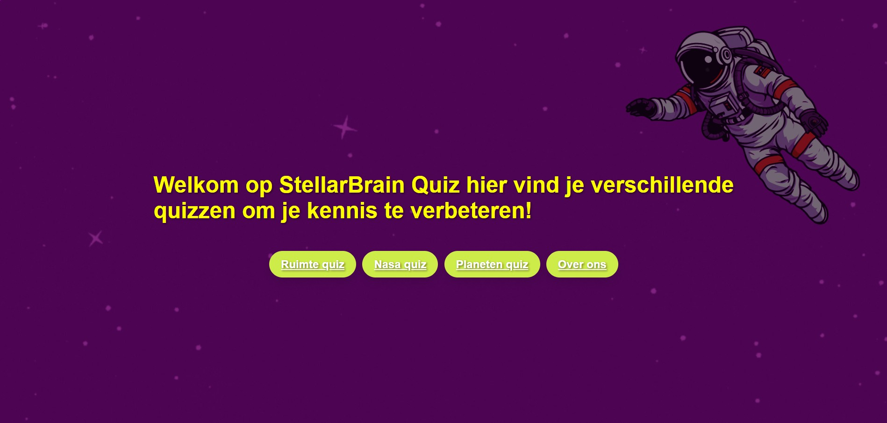
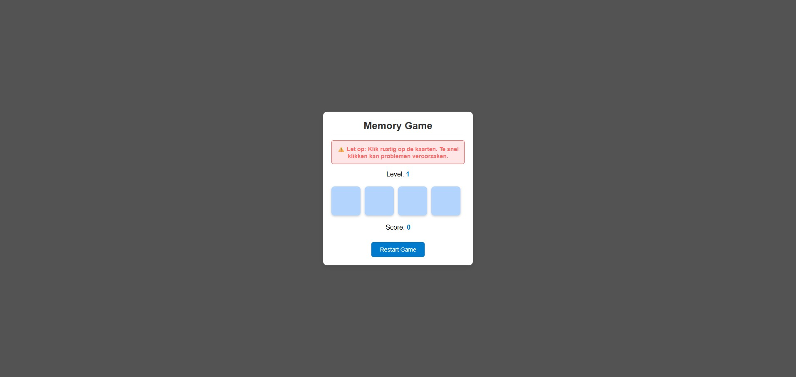

# Portfolio Website  

Dit is mijn persoonlijke **portfolio website** waarin ik mijn projecten, vaardigheden en contactgegevens presenteer. De site is ontworpen met oog voor eenvoud, responsiviteit en een moderne uitstraling.

## 🌐 Live Demo  
👉 [Bezoek mijn portfolio](https://100536.stu.sd-lab.nl/)  
*(opmerking: momenteel in ontwikkeling)*

## 📸 Screenshots  
  
  
  

## ✨ Functionaliteiten  
- **Homepagina** met introductie en welkomstboodschap  
- **Over mij**: korte samenvatting van wie ik ben en mijn opleiding  
- **Projectenpagina**: overzicht van gemaakte projecten met links en afbeeldingen  
- **Contactpagina**:  
  - Contactformulier met velden voor naam, e-mail, onderwerp en bericht  
  - Contactinformatie (e-mail, GitHub, LinkedIn, Instagram)  
- **Admin-omgeving**: login, projectbeheer, contactberichten en bezoekersstatistieken  
- **Dark/Light mode switch**  
- **Responsief design**: werkt zowel op desktop als mobiel  

## 🛠️ Gebruikte technologieën  
- **HTML5**  
- **CSS3** (custom styles, grid & flexbox, animaties)  
- **JavaScript (ES6)**: interactieve elementen, dark/light mode  
- **PHP 8** (PDO, sessies, CSRF-beveiliging, admin-CMS)  
- **MySQL** (projecten, contactberichten, activiteitenlog, bezoekersstatistieken)  

## 📂 Projectstructuur

```plaintext
portfolio/
│
├── public/                 # Webroot — alleen deze map is publiek bereikbaar
│   ├── index.php           # Startpagina
│   ├── image.php           # Serveert project-afbeeldingen uit de database
│   ├── assets/             # Statische bestanden
│   │   ├── css/            # admin.css, site.css
│   │   ├── js/             # Scripts (dark mode, animaties, analytics, login)
│   │   └── img/            # Afbeeldingen voor projecten en profiel
│   ├── pages/              # Publieke pagina's (about, project, contact, login)
│   ├── auth/               # Login-/logout-afhandeling
│   ├── admin/              # Beveiligde admin-omgeving (CMS)
│   ├── api/                # POST-endpoints (send_mail, track)
│   └── uploads/            # Geüploade bestanden (genegeerd door Git)
│
├── src/                    # Applicatiecode, NIET publiek bereikbaar
│   ├── bootstrap.php       # Laadt .env + helpers + database, levert $pdo
│   ├── env.php             # Lichte .env loader
│   ├── database.php        # PDO-verbinding o.b.v. .env
│   ├── helpers.php         # e(), slugify()
│   ├── session.php         # Veilige sessie-instellingen
│   ├── csrf.php            # CSRF-token helpers
│   ├── guard.php           # Authenticatie-guard voor admin
│   ├── activity.php        # Activiteitenlog (log_event)
│   └── housekeeping.php    # Automatisch opruimen van logs
│
├── tools/                  # Hulpscripts (bv. diag.php), niet publiek
├── .env.example            # Voorbeeldconfiguratie (wél in Git)
├── .env                    # Echte geheimen (NIET in Git)
├── .gitignore
└── README.md
```

## ⚙️ Installatie & lokaal draaien

1. **Repository klonen** en in de map gaan.
2. **Configuratie aanmaken**: kopieer `.env.example` naar `.env` en vul je
   databasegegevens in:
   ```bash
   cp .env.example .env
   ```
   ```dotenv
   DB_HOST=localhost
   DB_NAME=portfolio
   DB_USER=jouw_db_gebruiker
   DB_PASS=jouw_db_wachtwoord
   ```
   > `.env` staat in `.gitignore` en wordt nooit mee gecommit.
3. **Webroot instellen op `public/`.** Snel testen kan met de ingebouwde
   PHP-server:
   ```bash
   php -S localhost:8000 -t public
   ```
   Open daarna <http://localhost:8000>.
4. **Op een (school)server**: laat de document root naar de `public/`-map
   wijzen, zodat `src/` en `.env` niet via de browser bereikbaar zijn.

## 📧 Contact  

Wil je contact opnemen of samenwerken? Dat kan via:  

- **E-mail**: [lucas.werk@gmail.com](mailto:lucas.werk@gmail.com)  
- **GitHub**: [github.com/100536](https://github.com/100536)  
- **LinkedIn**: [LinkedIn profiel](https://www.linkedin.com/in/lucas-askamp-87031a2b7/)  
- **Instagram**: [@lucasaskamp](https://www.instagram.com/lucasaskamp/)  
